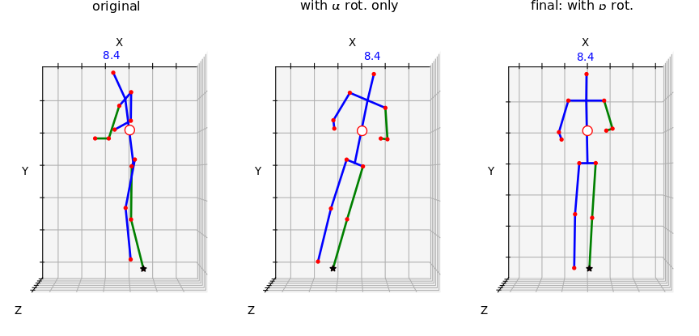

# LSTM action recognition

**NOTE:** This is a **fork** of Srijan Das et al.'s [LSTM_action_recognition](https://github.com/srijandas07/LSTM_action_recognition) code. Please read the original `README.md` there.

This repository fork is part of our efforts to reproduce the results of Das et al. 2019 (Toyota Smarthome paper).
We furthermore provide a series of **improvements related to pre-processing of skeletal data**, by applying a normalisation
that rotates all skeletons. This process is explained below.

## Downloads

You have the option of downloading the scripts and the Toyota Smarthomes dataset from [their website](https://project.inria.fr/toyotasmarthome/).

Alternativelt, you can get the pre-processed (rotated skeletons) from [this link](https://drive.google.com/file/d/1we1lrMJSmnZRzPmKYRcD-zyO8kZFfjw6/view?usp=sharing) to Google Drive. This have been processed by the code in this project. If you use this data, or the code, please cite our paper (Climent-Pérez et al. 2021).

**NOTE:** If the link is broken at some point in the future, please open an issue.

## Rotation modalities explained

The [Toyota SmartHome](https://project.inria.fr/toyotasmarthome/) dataset contains skeletons obtained from RGB images using LCR-Net (Rogez et al. 2018). These are provided as seen by the camera, not necessarily facing it. Furthermore, since cameras are installed on the wall, but near the ceiling and facing/tilted downwards, the skeletons are slightly _slanted_. 

Due to this, our `preprocessing/generate_normalised_skeletons.py` script rotates the skeletons to:

1. Make all skeletons _face_ the camera (rotation about _Y_ axis). Which gives view-invariant performance of activities, and,
2. _De-slant_ the skeletons (rotatation about _Z_ axis).

We call these corection angles alpha (&alpha;) and beta (&beta;), respectively.

## Changes to the original code

We have included a `config.py` file where most parameters can be tweaked, at will.

A new `preprocessing/` folder contains the following scripts:

* `calculate_class_weights.py` and `_CV.py`: These two calculate the class distribution among the training set for each
  of the two experiments: _cross-subject_ and _cross-view_. We use the generated dictionaries in the `fit_generator()`
  function call.
  
* `check_LR_rotation.py`: This is not necessary to run our variant, but is a quality check to see that the skeletons are
  still facing the camera after rotation (i.e. _left_ and _right_ are preserved).
  
* `create_folds_CS.py` and `_CV.py`: These are used, per the instructions provided in the Toyota Smarthome's paper
  (Das et al. 2019), to generate the _splits_ for training, validation, and test.
  
* Finally, `generate_normalised_skeletons.py` is the script where the rotations described in our _Sensors_ paper are
  performed (Climent et al. 2021, _submitted_). Also, see below.
  
Additional scripts to run the experiments on the published data have been added. That is, the original code assumed the
skeleton files had been transformed from `.json` to `.npz` matrices. However, the published data only contained the
`.json` files.

* `readers/smarthome_skeleton_fromjson_sampling.py` solves this issue, as it allows to load the skeletal data directly
  from `.json` files.
  
Furthermore, a modified `lstm_train_skeleton.py` script, with `_CV` variant, is used to train for the _cross-subject_ as well as _cross_view_ experiments. Finally, `lstm_evaluate.py` generates a confusion matrix which can be used to see the results on the test set. 

Skeleton visualistion scripts are also provided, under the `visualisers/` folder. The _3D_ version is a GPL-licensed version
of [LCR-Net's](https://thoth.inrialpes.fr/src/LCR-Net/) _3D_ skeleton visualiser.

## References

* **(Climent-Pérez et al. 2021)** Climent-Pérez, P., Florez-Revuelta, F. (2021). Improved action recognition with Separable spatio-temporalattention using alternative Skeletal and Video pre-processing, Sensors, _submitted_.
